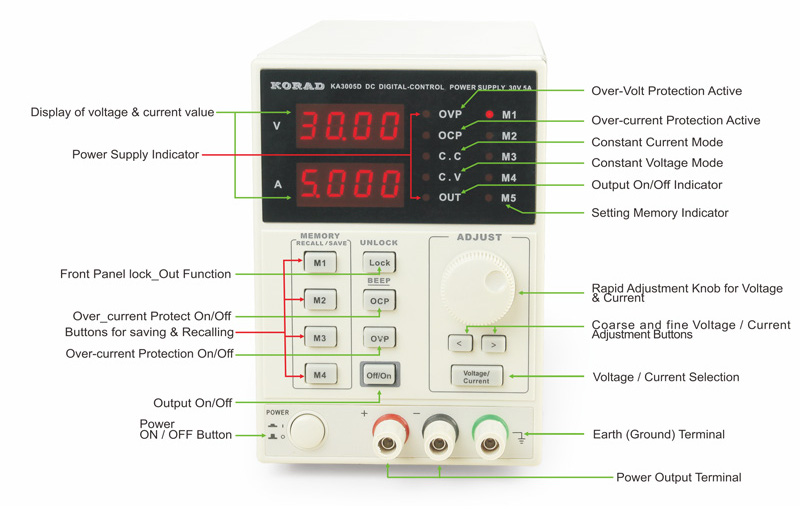
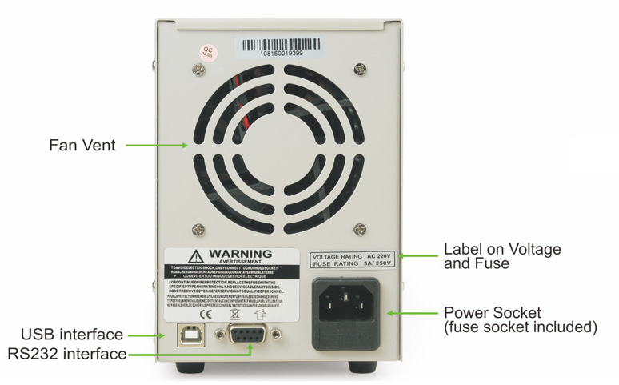

## Hardware
<table> 
  <tr>
    <th colspan="2">KA Series Power Supply From DONGGUAN KORAD TECHNOLOGY CO., LTD. </th> 
  </tr>
  <tr>
    <th>Front View</th>
    <td></img></td>
  </tr>
  <tr>
    <th>Back View</th>
    <td></img></td>
  </tr>
</table>

## Programming
* By using the USB interface, we can establish a serial communication between our computer and the power supply, and program it.
